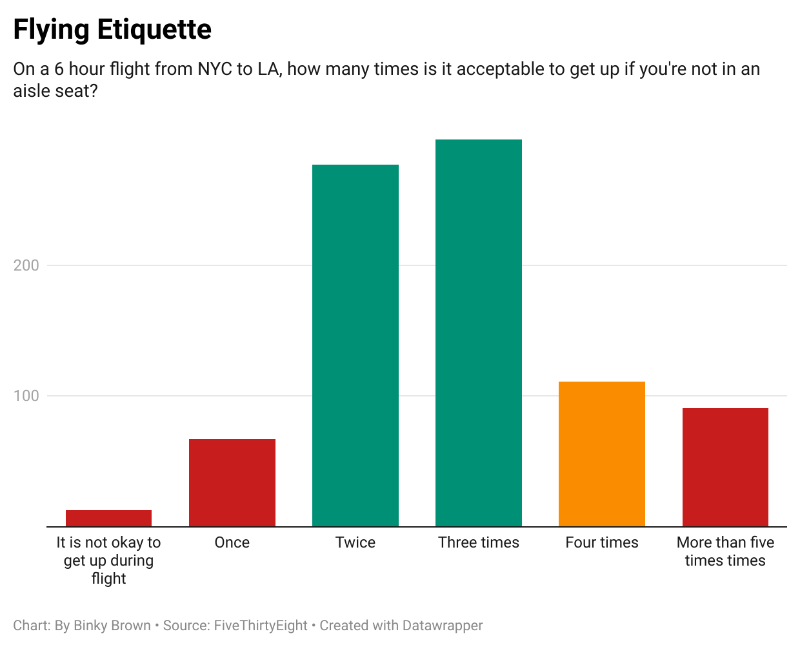

# Week_4, Quiz_4, Question_6

I chose to examine the question *"On a 6 hour flight from NYC to LA, how many times is it acceptable to get up if you're not in an aisle seat?"* because it had more than 3 variables but not too many.  It was also interesting to understand what people feel others should do.  

The data shows, that of the 855 respondents, <strong><em>67%</em></strong> indicated that getting up 2 or 3 times was acceptable.

